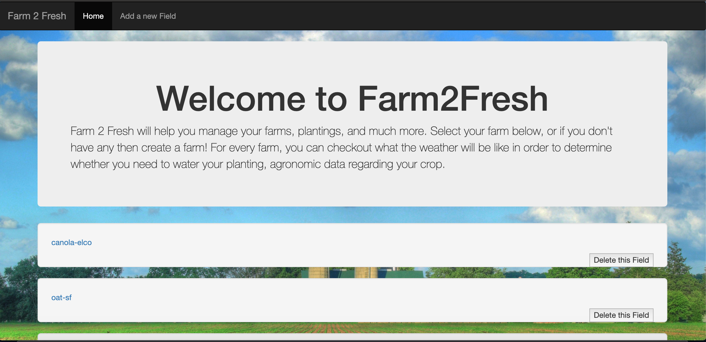
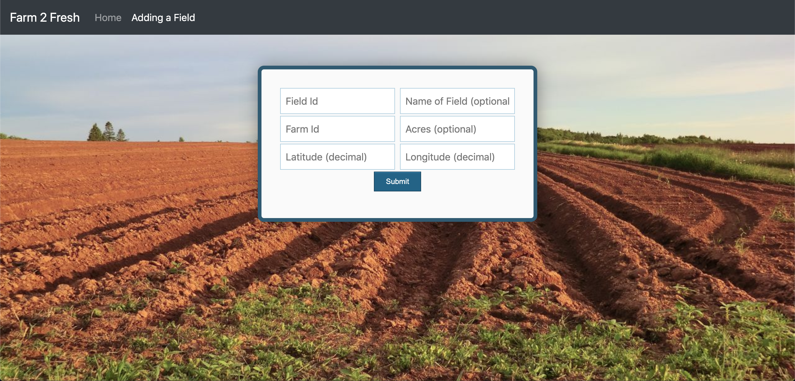
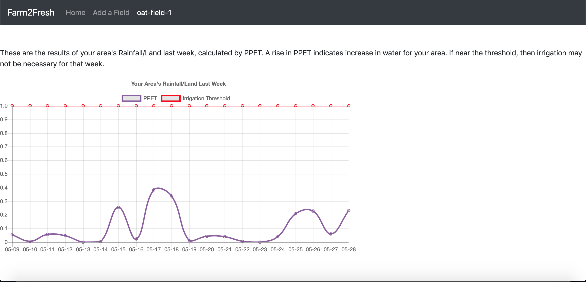
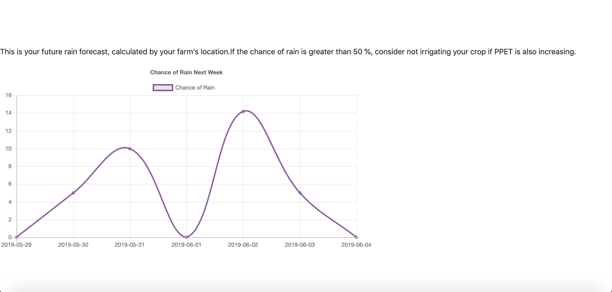
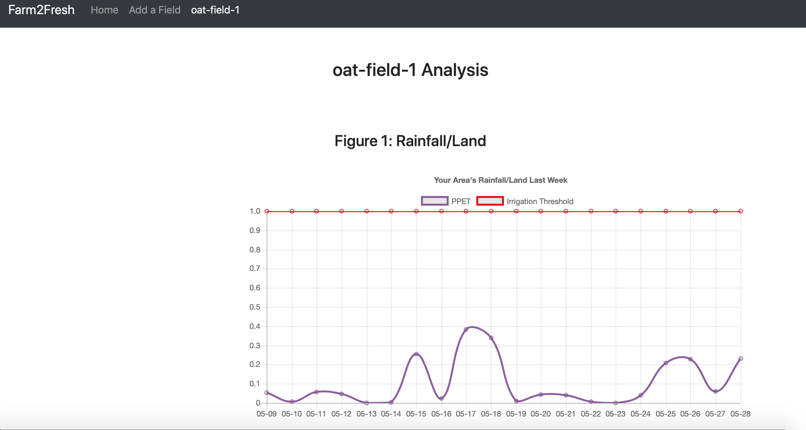

# 4square
COGS 121 Project

* Richard Pena
* Sadeem Khan
* Christian Lay
* Brandon Lien

### Farm2Fresh
--

### How App Is Used
---

Our target user population is for fairly new farmers who need a bit of guidance on how to produce the best crops. Say we have a new farmer who wants a better visualization of their crops as well as more information about the specific crops that they have. The farmer would use our app to accomplish this by first going to the homepage and getting familiar with how our app can assist them. Next, the user would use the "Add a new Field" tab to add the fields they have in their farm. They would enter all of the relevant information and then would be able to see their fields on the homepage. From the homepage, the farmer can then click any specific field and then add crops to that specific field. They will be requred to enter information such as the crop name, planting date, projected harvest date, etc. 

Once they have added a crop to their field, the user will be able to see weather information for that field and crop. This information includes the area's rainfall and irrigation threshold shown in a graph. They can see on the graph the irrigation threshold which lets them know irrigation may not be necessary for that week. There is also a graph which shows future rainfall predictions. 

After all of the users fields and crops are added, they can monitor their crops with help from the graphs provided. They also have the ability to delete a field in case certain fields need to be changed/removed. The user is satisfied after our app provides them an easy way to monitor their crops as well as inform them about their specific crops needs. 

### UI Webpages
---

### Homepage With Delete Field

### Adding a Field

### Your Crop Data

### Add Crop
 

### How UI Has Improved
---

The UI for our app has imprived in a few ways since the last milestone. The first major change can be seen from the homepage. We have implemented a delete field function. This allows the user to delete a field from their farm. Upon clicking the "delete field" button, the page will be refreshed and that field will no longer be available for the user. 

Furthermore, there has been updates in the styling of the add field tab. Next we now have two graphs shown to the user upon clicking on a field from the homepage. The first graph is the same from the previous milestone. The second graph shows expected rainfall for the upcoming week. The last change that can be seen is with our addCrop page. This page has updated styling which makes it much easier to use and view.  

### Data Visualization Screenshots
---

### Weather Data

### How Data Visualizations Implemented
---

### Ambitious Data Display Ideas
---